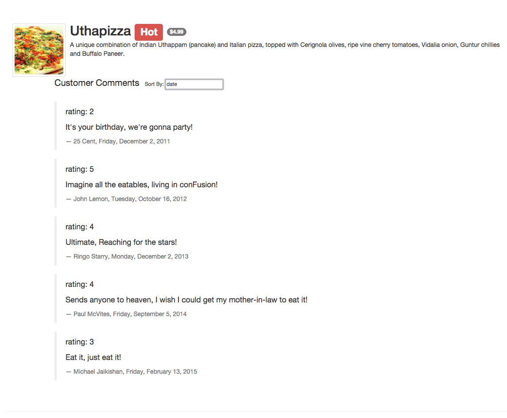

# IntroToAngularWeek01
This assignment addresses using angular to output an array with the use of the
angular "ng-repeat" directive and ordering by the "orderBy" filter.  The input
into the orderBy is done with 2-way binding that allows the array to be ordered
by any attribute in the array.

Here shown with the array ordered by date:
[//]: # (Comment) 
<figure></figure>
